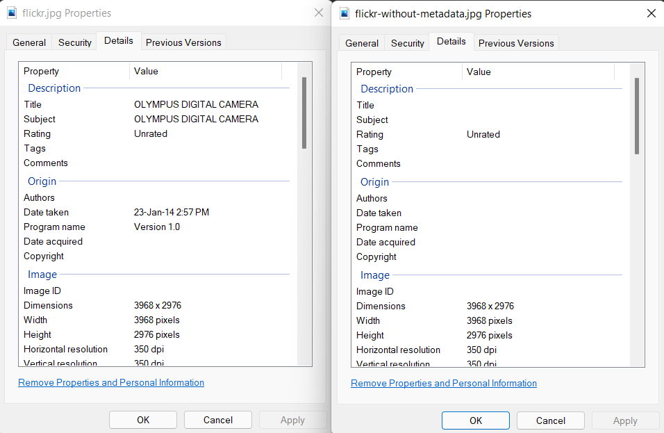
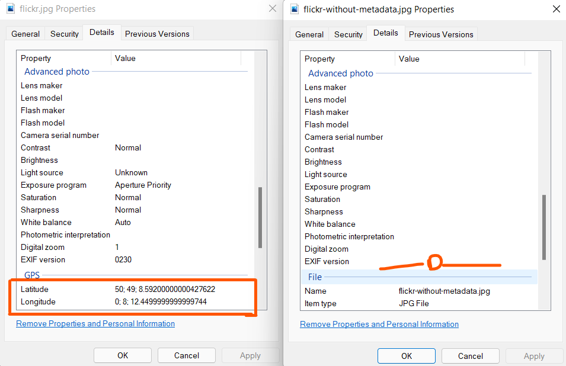

## Remove metadata from an image using C#/.NET
Blog post: https://lioncoding.com/how-to-remove-metadata-from-images-in-.net/

I downloaded the image from https://www.flickr.com/photos/cameralabs/12382975864/in/photostream/

This image contains EXIF and IPTC information.

Please note: I have no rights to this image, I'm using this image for demo purposes.

## Result

